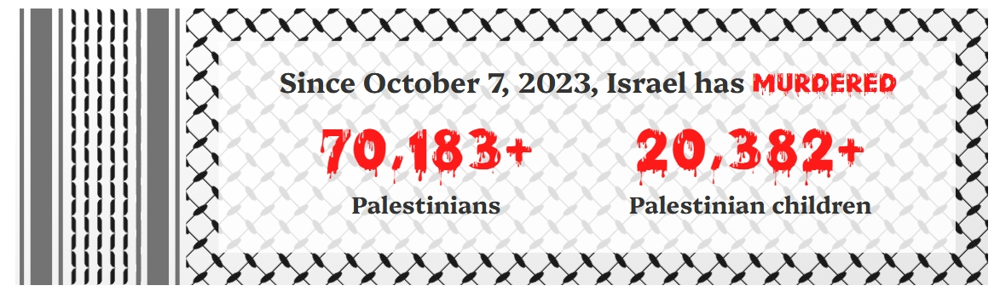

# Palestine Data Dashboard 


A **Streamlit dashboard** for visualizing daily casualties and key statistics from Gaza and West Bank datasets. This dashboard allows you to **upload multiple CSV files**, view key metrics, filter by date, visualize daily casualties, and download merged datasets.

---

## Features

- **Upload Multiple CSVs** for Gaza and West Bank datasets.
- **Auto-detect columns**: date, killed, children killed, women killed, injured, aid-seeker deaths, starved, medical personnel killed, journalists killed, first responders killed, settler attacks.
- **Key Figures Display**: Shows total statistics dynamically at the top of the dashboard.
- **Daily Casualties Chart**: Interactive line chart with **date slider** for filtering.
- **Download Datasets**: Export merged datasets as CSV or JSON.
- **Auto-save merged data** locally for future use.

---

## Installation

1. Clone the repository or download the code:

```bash
git clone <your-repo-url>
cd <your-project-folder>
```

2. Install required packages:

```bash
pip install streamlit pandas plotly
```

3. Run the dashboard:

```bash
streamlit run app.py
```

> Replace `app.py` with the filename of your dashboard script.

---

## Usage

1. Open the dashboard in your browser (Streamlit opens automatically).  
2. **Upload your CSV files** in the sidebar:
   - Daily Gaza datasets  
   - Daily West Bank datasets  
3. The dashboard will:
   - Merge your uploaded files
   - Save merged CSVs locally (`merged_gaza.csv`, `merged_west_bank.csv`)  
   - Show key metrics at the top  
   - Display the daily casualties chart with a date slider  

4. **Download merged datasets** as CSV or JSON from the "Download Datasets" tab.  

---

## Columns Detection

The dashboard automatically detects relevant columns in your CSVs. It looks for:

- `date` (or day/datetime/report_date)  
- `killed` (or casualties/death)  
- `children_killed`  
- `women_killed`  
- `injured`  
- `aid_seeker_killed`  
- `starved`  
- `medical_killed`  
- `journalists_killed`  
- `first_responders_killed`  
- `settler_attacks`  

If a column is missing, it will default to `0` for numeric fields or generate sequential dates for missing date columns.

---

## Screenshots

[Screenshot](Images/Screenshot_11-11-2025_21321_github.com.jpeg)

---

## Contributing

Feel free to open issues or submit pull requests to improve the dashboard. Suggestions for additional metrics, visualizations, or features are welcome!

---

## License

This project is licensed under the MIT License. See the `LICENSE` file for details.

---

## Acknowledgments

- Data visualization powered by **Plotly**.  
- Interactive web app built with **Streamlit**.  
- Inspired by the need for clear and accessible data on Palestine conflicts.
